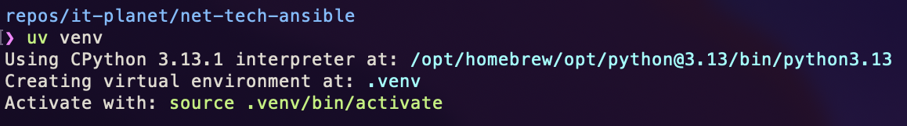
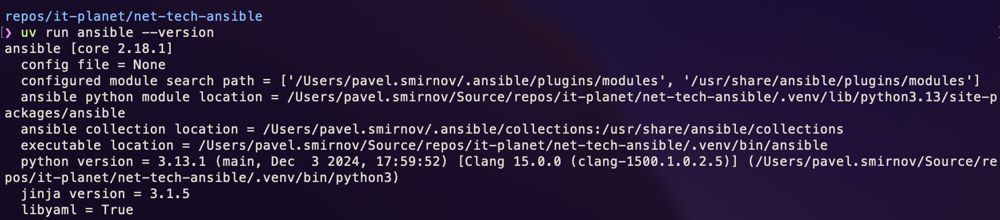
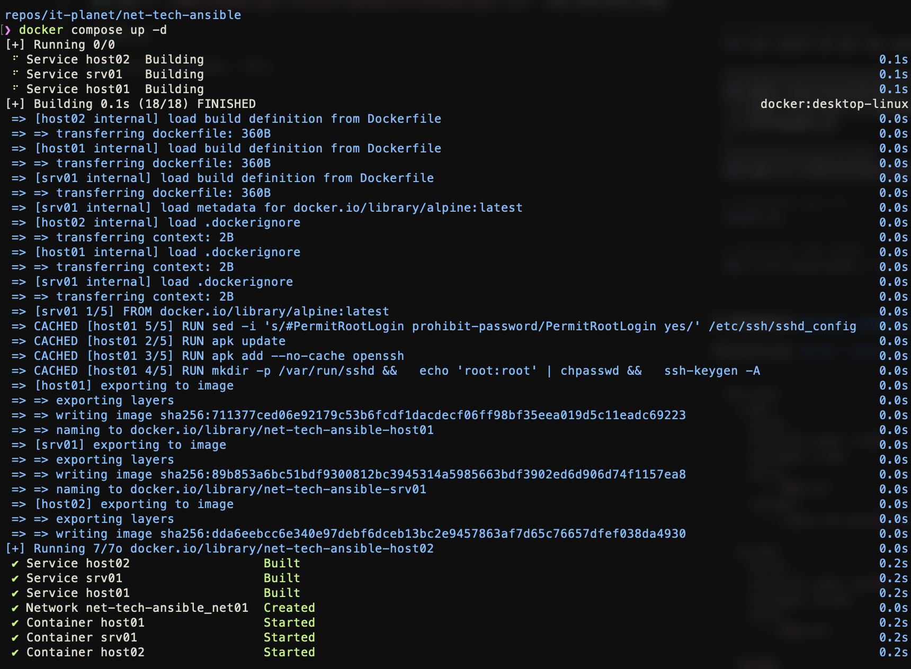
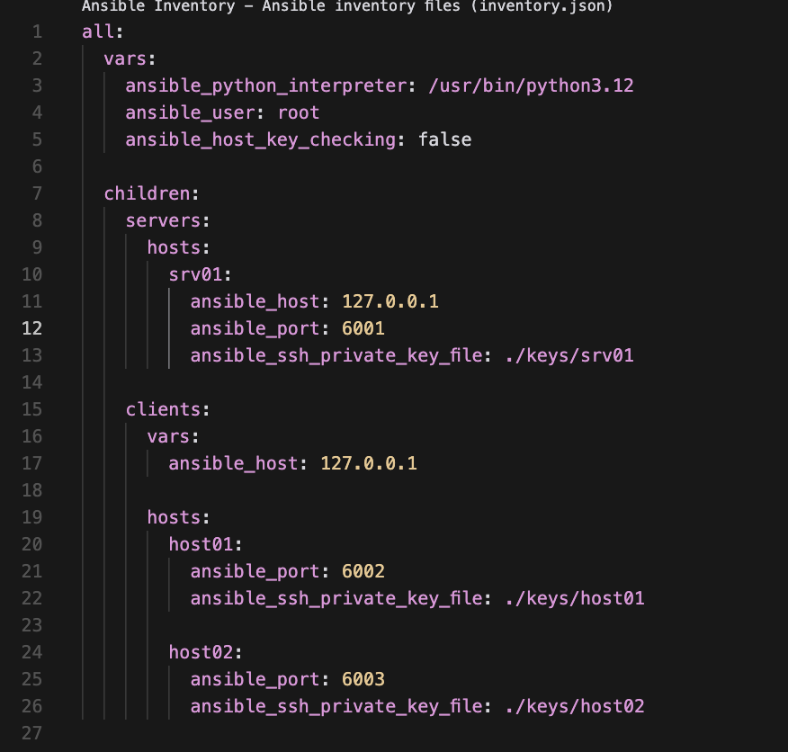
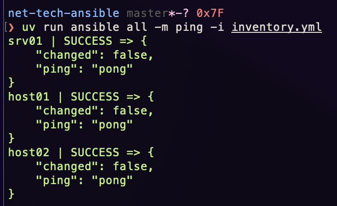
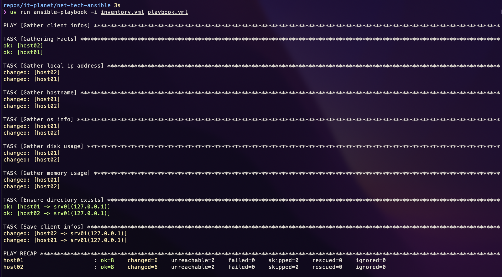
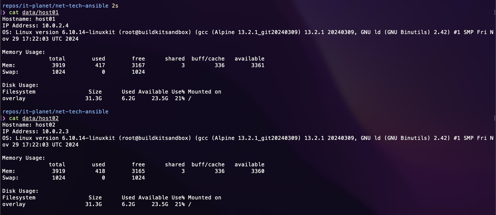

# Предисловие

Репозиторий на GitHub: https://github.com/pashokitsme/net-tech-ansible

Этот репозиторий, как и этот отчёт - первый этап [braim.org/network-contest](https://challenge.braim.org/landing/network_contest)

Изначально оформлено в .md и предполагалось к просмотру в README репозитория.

В ходе выполнения использовался пакетный (проектный) менеджер [uv](https://docs.astral.sh/uv/). Поэтому для вызова команд используется `uv run <command>`.

В качестве машин использовались три докер-контейнера с базовым образом `alpine` и установленным `python3` & `openssh`. Публичные и приватные ключи намеренно оставлены в `keys`, поскольку необходимы только для доступа к контейнерам, проверка хоста также отключена для удобства (т.к. требует `yes` после каждого ребилда).

# Задание

## Создание venv и установка ansible

Я обычно не использую ansible, поэтому он не был установлен на моём компьютере. Предпочту использовать venv для этого.





## Dockerfile

Для ansible необходимо наличие openssh и python3, но в alpine по умолчанию их нет, поэтому нужен `Dockerfile`.

```dockerfile
FROM alpine:latest

ARG PUBKEY_PATH

RUN apk update
RUN apk add --no-cache openssh python3

RUN mkdir -p /var/run/sshd && \
  echo 'root:root' | chpasswd && \
  ssh-keygen -A

RUN sed -i 's/#PermitRootLogin prohibit-password/PermitRootLogin yes/' /etc/ssh/sshd_config
RUN sed -i 's/#PubkeyAuthentication/PubkeyAuthentication/' /etc/ssh/sshd_config

EXPOSE 22

CMD ["/usr/sbin/sshd", "-D"]
```

## Создание docker-composе файла и поднятие контейнеров


Полная конфигурация представлена в файле `docker-compose.yml`.

Если кратко: публичные ключи из `keys` монтируются как `/root/.ssh/authorized_keys`, а для сервера `srv01` монтируется директория `data` -> `/etc/ansible/IT-Planet`, для того, чтобы был доступ с хоста.

```yaml
services:
  srv01:
    build: .
    container_name: srv01
    hostname: srv01
    volumes:
      - ./keys/srv01.pub:/root/.ssh/authorized_keys
      - ./data:/etc/ansible/IT-Planet
    networks:
      - net01
    ports:
      - 6001:22

  host01:
    build: .
    container_name: host01
    hostname: host01
    volumes:
      - ./keys/host01.pub:/root/.ssh/authorized_keys
    networks:
      - net01
    ports:
      - 6002:22

  host02:
    build: .
    container_name: host02
    hostname: host02
    volumes:
      - ./keys/host02.pub:/root/.ssh/authorized_keys
    networks:
      - net01
    ports:
      - 6003:22

networks:
  net01:
    driver: bridge
    ipam:
      config:
        - subnet: 10.0.2.0/24
          gateway: 10.0.2.1
```


Использование: `docker compose up -d --build`.




## Создание ansible inventory

Полная конфигурация представлена в файле `inventory.yml`.

Выключена проверка хоста, почему - описано выше. Порты для ssh указаны такие, как в `docker-compose.yml`, как и ключи.



### Тестовый пинг

Использование: `uv run ansible -i inventory.yml -m ping all`.




## Создание playbook

Конфигурация также представлена в файле `playbook.yml`.

```yaml
- name: Gather client infos
  hosts: clients
  vars:
    output_dir: '/etc/ansible/IT-Planet/'
    output_file: '{{ [output_dir, inventory_hostname] | path_join }}'
    output_host: srv01

  tasks:
    - name: Gather local ip address
      ansible.builtin.shell: hostname -i
      register: ip_local

    - name: Gather hostname
      ansible.builtin.shell: hostname
      register: hostname

    - name: Gather os info
      ansible.builtin.shell: cat /proc/version
      register: os_info

    - name: Gather disk usage
      ansible.builtin.shell: df -H /
      register: disk_usage

    - name: Gather memory usage
      ansible.builtin.shell: free -m
      register: memory_usage

    - name: Ensure directory exists
      ansible.builtin.file:
        path: '{{ output_dir }}'
        state: directory
      delegate_to: '{{ output_host }}'

    - name: Save client infos
      ansible.builtin.copy:
        content: |
          Hostname: {{ hostname.stdout }}
          IP Address: {{ ip_local.stdout }}
          OS: {{ os_info.stdout }}

          Memory Usage: 
          {{ memory_usage.stdout }}

          Disk Usage: 
          {{ disk_usage.stdout }}
        dest: '{{ output_file }}'
      delegate_to: '{{ output_host }}'
```

### Выполнение playbook

Использование: `uv run ansible-playbook -i inventory.yml playbook.yml`.



## Результат

Директория `data` примонтирована к контейнеру `srv01` к директории `/etc/ansible/IT-Planet`.



